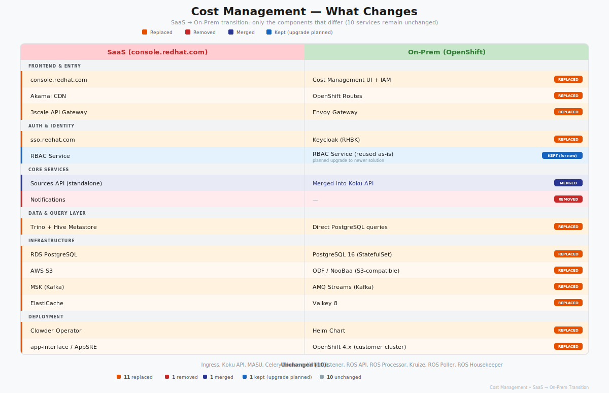
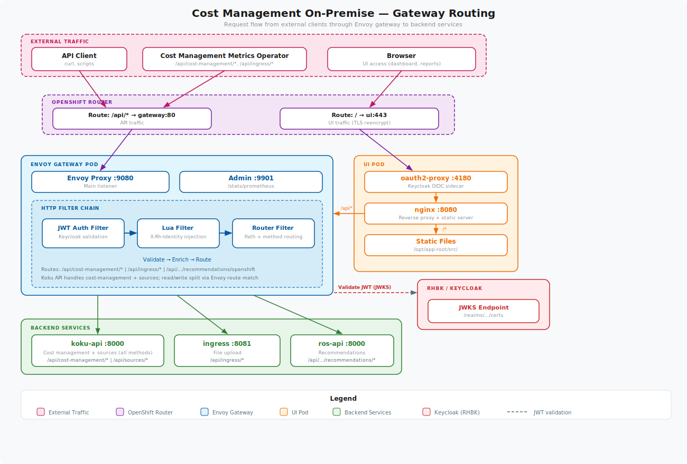

# Architecture Documentation

System design, component interactions, and technical architecture documentation for Cost Management On-Premise.

## SaaS to On-Prem Transition

## Gateway Routing

## Documents

| Document | Description |
|----------|-------------|
| **[Platform Guide](platform-guide.md)** | Overview of the ROS platform architecture, components, and how they interact |
| **[Helm Templates Reference](helm-templates-reference.md)** | Technical reference for all Helm chart templates and Kubernetes resources |
| **[Sources API Production Flow](sources-api-production-flow.md)** | Architecture and workflow for provider creation using Sources API and Kafka |
| **[External Keycloak Scenario](external-keycloak-scenario.md)** | Analysis and architecture for connecting to external Keycloak |

## Quick Links

- **Understanding the system?** Start with [Platform Guide](platform-guide.md)
- **Need technical details?** See [Helm Templates Reference](helm-templates-reference.md)
- **Setting up providers?** Read [Sources API Production Flow](sources-api-production-flow.md)
- **Using external Keycloak?** Check [External Keycloak Scenario](external-keycloak-scenario.md)

[← Back to Documentation Index](../README.md)
