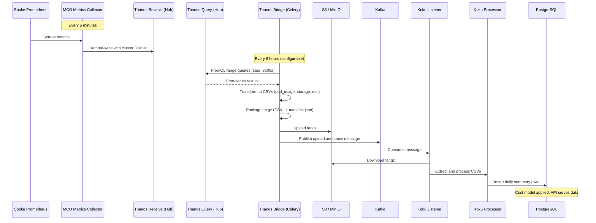

# Thanos Bridge: Centralized Metrics Collection for ACM-Managed Clusters

## 1. Motivation

Cost-onprem deployed on ACM (Advanced Cluster Management) hub clusters already runs MCO
(multicluster-observability-operator) and Thanos to collect metrics from all managed spoke
clusters. Running CMMO (koku-metrics-operator) on every spoke duplicates collection, adds
operational overhead, and creates a separate data path that must be maintained independently.

The Thanos Bridge replaces the CMMO + Ingress data path for ACM-managed clusters by reading
centralized metrics from Thanos and producing artifacts identical to what CMMO would generate,
feeding them into koku's existing processing pipeline.

### Design Principles

- **Zero downstream changes**: The bridge produces the same tar.gz artifact (CSVs + manifest.json)
  that CMMO produces. Everything from S3 onward is the existing proven path.
- **No spoke-side agents**: Eliminates the need to deploy, configure, and maintain CMMO on each
  spoke cluster.
- **Leverage existing infrastructure**: MCO already collects and centralizes metrics. The bridge
  queries what's already there.

---

## 2. Architecture Overview

### 2.1 Current Path (CMMO + Ingress)

```
Spoke Cluster                          Hub Cluster (cost-onprem)
+------------------+                   +----------------------------------+
| Prometheus       |                   |                                  |
|   |              |                   |   Ingress Service                |
|   v              |                   |     |                            |
| CMMO Operator    |  -- tar.gz -->    |     v                            |
|  (scrape, CSV,   |  HTTP upload      |   Kafka (upload.announce)        |
|   package,       |                   |     |                            |
|   upload)        |                   |     v                            |
+------------------+                   |   Listener --> Processor --> DB  |
                                       |                                  |
                                       +----------------------------------+
```

Each spoke runs a CMMO instance that:
1. Scrapes the local Prometheus for kube-state-metrics, cadvisor, kubelet metrics
2. Transforms time-series into CSV files (pod_usage, storage_usage, node_labels, etc.)
3. Packages CSVs + manifest.json into a tar.gz
4. Uploads the tar.gz to the hub's Ingress service via HTTP
5. Ingress writes to S3 and publishes a Kafka message
6. Koku Listener picks up the message, downloads the tar.gz, and processes it

### 2.2 New Path (Thanos Bridge)

```
Spoke Cluster                          Hub Cluster
+------------------+                   +----------------------------------------------+
| Prometheus       |                   |                                              |
|   |              |                   |  ACM / MCO Stack                             |
|   v              |                   |  +------------------+                        |
| MCO Metrics      |  remote-write     |  | Thanos Receive   |                        |
| Collector        | ----------------> |  |   |              |                        |
| (adds clusterID) |  (every 5 min)    |  |   v              |                        |
+------------------+                   |  | Thanos Query     |                        |
                                       |  +--------|---------+                        |
Spoke Cluster N                        |           |                                  |
+------------------+                   |           | PromQL range queries             |
| (same as above)  | ----------------> |           |                                  |
+------------------+                   |  cost-onprem (koku)                          |
                                       |  +--------v---------+                        |
                                       |  | Thanos Bridge    |  (Celery scheduled)    |
                                       |  |  query -> CSV    |                        |
                                       |  |  package tar.gz  |                        |
                                       |  +--|---------|-----+                        |
                                       |     |         |                              |
                                       |     v         v                              |
                                       |    S3      Kafka (upload.announce)           |
                                       |     |         |                              |
                                       |     v         v                              |
                                       |  Listener (download from S3)                 |
                                       |     |                                        |
                                       |     v                                        |
                                       |  Processor --> Cost Model --> DB --> API     |
                                       |                                              |
                                       +----------------------------------------------+
```

The bridge runs as a Celery task on the hub. For each registered spoke cluster:
1. Queries Thanos Query API with PromQL (same metrics CMMO collects)
2. Transforms Prometheus time-series into CMMO-equivalent CSV DataFrames
3. Packages CSVs + manifest.json into an identical tar.gz
4. Uploads directly to S3 (bypasses Ingress)
5. Publishes a Kafka message to `platform.upload.announce`
6. Existing Listener/Processor pipeline handles the rest unchanged

### 2.3 Data Flow Sequence



---

## 3. Components

### 3.1 MCO Metrics Collector (Spoke-Side, Existing)

**Repository:** `stolostron/multicluster-observability-operator`
**Location:** `operators/endpointmetrics/controllers/observabilityendpoint/metrics_collector.go`

The MCO metrics-collector runs on each spoke cluster as a DaemonSet managed by the
`endpoint-metrics-operator`. It:

- Scrapes the spoke's Prometheus every 5 minutes
- Filters metrics against the MCO allowlist (ConfigMap `observability-metrics-allowlist`)
- Adds the `clusterID` label to every metric, set to the OCP cluster UUID from
  `ClusterVersion.spec.clusterID` (`metrics_collector.go:892`: `--label="clusterID=%s"`)
- Remote-writes to the hub's Thanos Receive via the observatorium API

**Required change:** The MCO metrics allowlist must be extended to include cost management
metrics not already present. See [Section 5.1](#51-mco-metrics-allowlist-extension).

### 3.2 Thanos (Hub-Side, Existing)

**Namespace:** `open-cluster-management-observability`

| Component | Role |
|-----------|------|
| `thanos-receive` | Accepts remote-write from spoke collectors |
| `thanos-store-shard` | Long-term storage backed by S3 |
| `thanos-compact` | Compaction and downsampling |
| `thanos-query` | Federated query across all stores |

The bridge queries `thanos-query` via its HTTP API at:
`http://observability-thanos-query.open-cluster-management-observability.svc:9090`

No changes required to the Thanos stack itself.

### 3.3 Thanos Bridge (New)

**Repository:** `insights-onprem/koku`
**Location:** `koku/masu/external/thanos_bridge/`

```
thanos_bridge/
  __init__.py
  bridge.py              # Orchestrator: Celery task entry point
  thanos_client.py       # HTTP client for Thanos Query API
  queries.py             # 34 PromQL query definitions across 7 groups
  csv_transformer.py     # Prometheus time-series -> CMMO-equivalent CSV DataFrames
  cluster_mapper.py      # Koku DB: cluster_id -> org_id via Sources/Provider
  manifest_builder.py    # Generate manifest.json
  packager.py            # CSVs + manifest -> tar.gz
  publisher.py           # Upload to S3 + publish to Kafka
```

#### 3.3.1 Bridge Orchestrator (`bridge.py`)

Entry point: `run_bridge()`, invoked by the Celery task `run_thanos_bridge`.

Execution flow:
1. Read configuration from environment variables
2. Query `get_active_ocp_clusters()` to discover registered spoke clusters
3. Compute time window: `window_end = now.replace(minute=0)`, `window_start = window_end - timedelta(hours=time_window_hours)`
4. For each cluster, call `_process_cluster()`:
   - Execute all PromQL queries against Thanos, injecting `clusterID="{uuid}"` into every metric selector
   - Transform results into 6 CSV DataFrames (pod_usage, storage_usage, node_labels, namespace_labels, vm_usage, gpu_usage)
   - Package non-empty DataFrames into tar.gz with manifest.json
   - Upload to S3 and publish Kafka message

The `_inject_cluster_id()` function is a token-based PromQL parser that adds `clusterID="{uuid}"`
to every metric selector in the query, handling nested expressions, label matchers, and
aggregation contexts.

#### 3.3.2 Thanos Client (`thanos_client.py`)

HTTP client for the Thanos Query API:
- Uses `requests.Session` with retry strategy (3 retries, backoff on 429/5xx)
- `query_range()` — range queries with `step=3600` (hourly resolution)
- `query_instant()` — point-in-time queries
- Configurable timeout (default 120s per query)
- Optional Bearer token authentication and TLS verification

#### 3.3.3 Query Definitions (`queries.py`)

34 PromQL queries organized into 7 groups, ported from CMMO's `queries.go`:

| Group | Queries | Metrics Collected |
|-------|---------|-------------------|
| `node` (6) | allocatable CPU/memory, capacity CPU/memory, role, labels | Node-level capacity and metadata |
| `pod` (7) | limit/request/usage CPU/memory, labels | Pod-level resource consumption |
| `volume` (7) | PV/PVC capacity/request/usage, labels, pod mapping | Persistent storage |
| `vm` (12) | CPU/memory limit/request/usage, info, disk, labels | KubeVirt virtual machines |
| `namespace` (1) | namespace labels | Namespace metadata |
| `gpu_capacity` (1) | NVIDIA GPU memory capacity per pod | GPU capacity |
| `gpu_utilization` (1) | DCGM GPU engine utilization per pod | GPU usage |

Each `QueryDefinition` specifies:
- `name` — unique identifier
- `promql` — the PromQL expression
- `metric_key` — label-to-column mappings
- `metric_key_regex` — regex patterns for dynamic labels (e.g., `label_*`)
- `row_key` — labels that define row identity
- `value_config` — aggregation method (`max`/`sum`) and transformed column name

#### 3.3.4 CSV Transformer (`csv_transformer.py`)

Converts Prometheus query results into DataFrames matching koku's expected column schemas
defined in `masu/util/ocp/common.py`:

| CSV Type | Columns | Source Schema |
|----------|---------|---------------|
| `pod_usage` | 20 columns (pod, namespace, node, resource_id, CPU/memory usage/request/limit *_seconds, node capacity, pod_labels) | `CPU_MEM_USAGE_COLUMNS` |
| `storage_usage` | 18 columns (namespace, pod, PV/PVC, storageclass, CSI, capacity/request/usage *_byte_seconds, labels) | `STORAGE_COLUMNS` |
| `node_labels` | 6 columns (node, node_labels) | `NODE_LABEL_COLUMNS` |
| `namespace_labels` | 6 columns (namespace, namespace_labels) | `NAMESPACE_LABEL_COLUMNS` |
| `vm_usage` | 33 columns (VM name, CPU/memory/disk metrics, OS info, labels) | `VM_USAGE_COLUMNS` |
| `gpu_usage` | 12 columns (pod, GPU UUID, model, vendor, memory capacity, uptime) | `GPU_USAGE_COLUMNS` |

Key transformations:
- **Seconds multiplication**: Raw gauge values (e.g., CPU cores) are multiplied by `step_seconds`
  (3600) to produce `*_core_seconds` / `*_byte_seconds` values, matching CMMO's reporting format
- **Label serialization**: Prometheus labels matching `label_*` are serialized as pipe-delimited
  `key:value` strings (e.g., `label_app:nginx|label_env:prod`)
- **Interval alignment**: Each hourly evaluation point produces an `interval_start` and
  `interval_end` timestamp in OCP datetime format (`%Y-%m-%d %H:%M:%S +0000 UTC`)
- **Report period**: Calendar month boundaries (`report_period_start` = 1st of month,
  `report_period_end` = 1st of next month)

#### 3.3.5 Cluster Mapper (`cluster_mapper.py`)

Queries koku's Django ORM for active OCP sources:

```python
Sources.objects
    .select_related("provider", "provider__authentication", "provider__customer")
    .filter(provider__type=Provider.PROVIDER_OCP, pending_delete=False, paused=False)
    .exclude(provider__authentication__credentials__cluster_id__isnull=True)
    .exclude(provider__authentication__credentials__cluster_id="")
```

Returns a list of `ClusterInfo` objects with:
- `cluster_id` — OCP cluster UUID (matches `clusterID` label in Thanos)
- `org_id` — tenant organization ID
- `provider_uuid` — koku provider UUID
- `source_id` — koku source ID
- `schema_name` — PostgreSQL tenant schema name

#### 3.3.6 Manifest Builder (`manifest_builder.py`)

Generates `manifest.json` compatible with koku's `extract_payload_contents()`:

```json
{
  "uuid": "<random-uuid>",
  "cluster_id": "<ocp-cluster-uuid>",
  "version": "thanos-bridge:1.0.0",
  "date": "2026-03-08T18:00:00+00:00",
  "files": ["<uuid>_pod_usage.csv", "<uuid>_storage_usage.csv", ...],
  "start": "2026-03-08T12:00:00+00:00",
  "end": "2026-03-08T18:00:00+00:00",
  "certified": false,
  "daily_reports": true,
  "cr_status": {"source": {"source_type": "thanos_bridge"}}
}
```

The `start` and `end` fields are required by koku's summary table population logic.

#### 3.3.7 Packager (`packager.py`)

Creates a `tar.gz` archive containing:
- `manifest.json` — at archive root
- `<uuid>_<report_type>.csv` — one file per non-empty report type

This matches the archive structure expected by `kafka_msg_handler.extract_payload_contents()`.

#### 3.3.8 Publisher (`publisher.py`)

Two-phase publish:
1. **S3 upload** — Uses `copy_data_to_s3_bucket()` from `masu.util.aws.common`, then generates
   a pre-signed URL (1-hour expiry) for the Listener to download
2. **Kafka publish** — Produces a message to `platform.upload.announce` with header
   `service: hccm`:
   ```json
   {
     "request_id": "<uuid>",
     "b64_identity": "",
     "org_id": "<org-id>",
     "url": "<presigned-s3-url>",
     "timestamp": ""
   }
   ```

### 3.4 Koku Listener (Existing, No Changes)

The Listener consumes `platform.upload.announce` messages with header `service: hccm`.
For each message, it:
1. Downloads the tar.gz from the S3 URL
2. Extracts contents and parses `manifest.json`
3. Validates the source/provider exists in koku
4. Creates daily CSV archives and uploads them to S3
5. Triggers the processing pipeline

No code changes are needed. The Listener operates on the tar.gz artifact format, which the
bridge produces identically to CMMO.

### 3.5 Koku Processor (Existing, No Changes)

The Processor reads daily CSV archives from S3, parses them according to column schemas,
inserts data into `reporting_ocpusagelineitem_daily_summary`, and triggers cost model
application and summary refresh.

### 3.6 Helm Chart Integration

**Repository:** `insights-onprem/cost-onprem-chart`

#### Configuration (`values.yaml`)

```yaml
costManagement:
  thanosBridge:
    enabled: false
    schedule: "0 */6 * * *"
    timeWindowHours: 6
    queryTimeout: 120
    thanosQueryUrl: ""
```

#### Environment Variable Injection (`_helpers-koku.tpl`)

When `thanosBridge.enabled: true`, the following environment variables are injected into koku
deployments (API, MASU, Listener, Celery Beat):

| Variable | Source | Description |
|----------|--------|-------------|
| `THANOS_BRIDGE_ENABLED` | `.Values.costManagement.thanosBridge.enabled` | Feature gate |
| `THANOS_QUERY_URL` | `.Values.costManagement.thanosBridge.thanosQueryUrl` | Thanos Query API URL (required) |
| `THANOS_BRIDGE_SCHEDULE` | `.Values.costManagement.thanosBridge.schedule` | Cron expression |
| `THANOS_BRIDGE_TIME_WINDOW_HOURS` | `.Values.costManagement.thanosBridge.timeWindowHours` | Query window size |
| `THANOS_BRIDGE_QUERY_TIMEOUT` | `.Values.costManagement.thanosBridge.queryTimeout` | Per-query timeout |

The `thanosQueryUrl` is validated with Helm's `required` function and will fail template
rendering if not provided when the bridge is enabled.

#### Celery Beat Schedule (`koku/celery.py`)

```python
if ENVIRONMENT.bool("THANOS_BRIDGE_ENABLED", default=False):
    bridge_expression = ENVIRONMENT.get_value("THANOS_BRIDGE_SCHEDULE", default="0 */6 * * *")
    THANOS_BRIDGE_CRON = validate_cron_expression(bridge_expression)
    app.conf.beat_schedule["run-thanos-bridge"] = {
        "task": "masu.celery.tasks.run_thanos_bridge",
        "schedule": crontab(*THANOS_BRIDGE_CRON.split(" ", 5)),
    }
```

---

## 4. Downstream Contract Preservation

The bridge is designed so that everything from S3 onward is unchanged. This table shows
the contract points and how the bridge maintains compatibility:

| Contract Point | CMMO Produces | Bridge Produces | Match |
|---------------|---------------|-----------------|-------|
| Archive format | `tar.gz` with `manifest.json` + CSVs at root | Identical | Yes |
| Manifest fields | `uuid`, `cluster_id`, `version`, `date`, `files`, `start`, `end` | Identical structure | Yes |
| CSV column schemas | `CPU_MEM_USAGE_COLUMNS`, `STORAGE_COLUMNS`, etc. | Same columns, same names | Yes |
| Value units | `*_core_seconds`, `*_byte_seconds` (gauge * interval) | Same multiplication (`value * 3600s`) | Yes |
| Label format | Pipe-delimited `label_key:value` | Same serialization | Yes |
| Kafka topic | `platform.upload.announce` | Same topic | Yes |
| Kafka header | `service: hccm` | Same header | Yes |
| Kafka message | `{request_id, b64_identity, org_id, url, timestamp}` | Same schema | Yes |
| S3 storage | Uploaded by Ingress | Uploaded directly by bridge | Functionally equivalent |

---

## 5. Required Changes by Component

### 5.1 MCO Metrics Allowlist Extension

**File:** `observability-metrics-custom-allowlist` ConfigMap in
`open-cluster-management-observability` namespace

The following cost management metrics must be added to the MCO allowlist. Metrics already
present in the default allowlist are excluded.

#### Metrics to Add

| Metric | Purpose | Query Group |
|--------|---------|-------------|
| `kube_node_info` | `provider_id` for node-to-cloud resource mapping | node |
| `kube_pod_status_phase` | Filter running pods in cost queries | pod |
| `kube_pod_labels` | Pod label reporting | pod |
| `kube_persistentvolume_capacity_bytes` | PV capacity | volume |
| `kube_persistentvolume_info` | Storageclass, CSI driver info | volume |
| `kube_persistentvolume_labels` | PV labels | volume |
| `kube_persistentvolumeclaim_info` | Volume name mapping | volume |
| `kube_persistentvolumeclaim_labels` | PVC labels | volume |
| `kube_persistentvolumeclaim_resource_requests_storage_bytes` | Storage request | volume |
| `kube_pod_spec_volumes_persistentvolumeclaims_info` | Pod-to-PVC mapping | volume |
| `kubelet_volume_stats_used_bytes` | PVC actual usage | volume |
| `container_cpu_usage_seconds_total` | Pod CPU usage | pod |
| `container_memory_usage_bytes` | Pod memory usage | pod |
| `kube_namespace_labels` | Namespace labels | namespace |
| `kubevirt_vm_resource_limits` | VM CPU/memory limits | vm |
| `kubevirt_vm_labels` | VM labels | vm |
| `DCGM_FI_PROF_GR_ENGINE_ACTIVE` | NVIDIA GPU utilization | gpu |

#### Metrics Already in MCO Default Allowlist (No Action)

`kube_node_status_allocatable`, `kube_node_status_capacity`, `kube_node_labels`,
`kube_node_role`, `kube_pod_container_resource_limits`,
`kube_pod_container_resource_requests`, `kube_pod_info`, `kube_pod_owner`,
`kubelet_volume_stats_available_bytes`, `kubelet_volume_stats_capacity_bytes`,
`container_memory_rss`, `container_memory_working_set_bytes`, `kubevirt_vmi_*`,
`kubevirt_vm_resource_requests`, `kubevirt_vm_disk_allocated_size_bytes`

#### Deployment

The custom allowlist is deployed as a ConfigMap. MCO reconciles it and propagates the updated
allowlist to all spoke collectors within ~10 minutes.

```yaml
apiVersion: v1
kind: ConfigMap
metadata:
  name: observability-metrics-custom-allowlist
  namespace: open-cluster-management-observability
data:
  metrics_list.yaml: |
    names:
      - container_cpu_usage_seconds_total
      - container_memory_usage_bytes
      - container_memory_rss
      - container_memory_working_set_bytes
      - kube_node_info
      - kube_node_labels
      - kube_node_role
      - kube_namespace_labels
      - kube_pod_labels
      - kube_pod_status_phase
      - kube_pod_container_info
      - kube_pod_container_resource_requests
      - kube_pod_container_resource_limits
      - kube_persistentvolume_capacity_bytes
      - kube_persistentvolume_info
      - kube_persistentvolume_labels
      - kube_persistentvolumeclaim_info
      - kube_persistentvolumeclaim_labels
      - kube_persistentvolumeclaim_resource_requests_storage_bytes
      - kube_pod_spec_volumes_persistentvolumeclaims_info
      - kubelet_volume_stats_used_bytes
```

Note: Some metrics in this list (`kube_node_labels`, `kube_node_role`,
`kube_pod_container_resource_requests`, `kube_pod_container_resource_limits`,
`container_memory_rss`, `container_memory_working_set_bytes`) are also in the MCO default
allowlist. Including them in the custom allowlist is harmless — MCO deduplicates.

#### Allowlist Propagation

When this ConfigMap is created or updated:
1. MCO's `observability-operator` detects the change
2. Merges custom metrics with the default allowlist
3. Updates the `observability-metrics-allowlist` ConfigMap on each spoke cluster
4. Spoke metrics-collector restarts and begins collecting the new metrics
5. New metrics appear in hub Thanos within the next collection interval (~5 minutes)

#### Important: MCO Allowlist Behavior for Recording Rules

MCO treats certain metrics specially. Even when a metric is listed in `names:`, MCO may
forward only the recording rule aggregation rather than the raw metric. This is the case for:
- `kube_pod_container_resource_requests` — only the `:sum` recording rule (namespace-level)
  is forwarded, not the raw per-pod metric
- `kube_pod_container_resource_limits` — same behavior

See [Gap 6.2](#62-per-pod-resource-requestslimits-not-available-via-thanos) for impact.

### 5.2 Koku Code Changes

| File | Change | Status |
|------|--------|--------|
| `koku/masu/external/thanos_bridge/` (all files) | New module: bridge implementation | Complete |
| `koku/masu/celery/tasks.py` | New task: `run_thanos_bridge` | Complete |
| `koku/koku/celery.py` | Beat schedule: `run-thanos-bridge` gated by `THANOS_BRIDGE_ENABLED` | Complete |
| `koku/api/urls.py` | Fix: `DefaultRouter()` to restore trailing slash for sources endpoint | Complete |

### 5.3 Helm Chart Changes

| File | Change | Status |
|------|--------|--------|
| `values.yaml` | `costManagement.thanosBridge` section | Complete |
| `_helpers-koku.tpl` | Environment variable injection for bridge config | Complete |

---

## 6. Known Gaps and Issues

### 6.1 Source Auto-Creation for Spoke Clusters

**Severity:** High
**Status:** Open design decision

The Thanos Bridge reads existing sources from koku's database via `get_active_ocp_clusters()`
but does not create them. In the CMMO path, the operator on each spoke self-registers as a
source during startup. With the Thanos Bridge, there is no operator on the spoke.

Spoke cluster sources must be pre-registered via the koku API with a matching `cluster_id`
before the bridge can collect data for that cluster.

**Options:**

| Option | Description | Pros | Cons |
|--------|-------------|------|------|
| A. ACM ManagedCluster auto-discovery | Bridge queries hub's `ManagedCluster` CRs to discover spokes, auto-registers in koku. `clusterID` from `status.clusterClaims` (claim `id.k8s.io`) | Fully automated, zero manual steps | Couples bridge to ACM API; requires RBAC for ManagedCluster reads |
| B. Thanos label discovery | Bridge queries Thanos for distinct `clusterID` labels across metrics, creates sources for unregistered clusters | No ACM dependency | Cannot determine `org_id`/customer without external mapping |
| C. Manual registration | Admin creates sources via API before enabling the bridge | Simplest, no code changes | Operational burden, blocks automation |

**Recommendation:** Option A for ACM deployments.

### 6.2 Per-Pod Resource Requests/Limits Not Available via Thanos

**Severity:** Medium
**Status:** Known MCO architectural constraint

`kube_pod_container_resource_requests` and `kube_pod_container_resource_limits` are listed
in the MCO allowlist `names:` section, but MCO only forwards recording rule aggregations
(`:sum` variants at namespace level). The raw per-pod metrics are not propagated to Thanos.

**Impact:**
- `pod_request_cpu_core_seconds`, `pod_request_memory_byte_seconds`,
  `pod_limit_cpu_core_seconds`, `pod_limit_memory_byte_seconds` columns in `pod_usage`
  CSV are zeroed.
- Cost calculations relying on request-based distribution are affected.
- Usage-based calculations (actual CPU/memory consumption) work correctly.

**Workaround:** Cost models should use usage-based rates rather than request-based distribution
when operating on Thanos Bridge data.

**Potential fix:** MCO code change to forward raw per-pod metrics in addition to recording
rules. This requires an upstream contribution to the `multicluster-observability-operator`.

### 6.3 PromQL rate() Window vs MCO Collection Interval

**Severity:** Medium
**Status:** Fixed

MCO's metrics-collector sends data every 5 minutes. `rate([5m])` requires at least 2 samples
within the window. With 5-minute collection intervals, samples are ~5 minutes apart, so a
5-minute `rate()` window often captures only 1 sample, producing empty results.

**Fix applied:** Changed `rate()` and `sum_over_time()` windows from `[5m]` to `[15m]` in
`queries.py` for:
- `pod-usage-cpu-cores` (`container_cpu_usage_seconds_total`)
- `vm_cpu_usage` (`kubevirt_vmi_cpu_usage_seconds_total`)
- `vm_memory_usage` (`kubevirt_vmi_memory_used_bytes`)

This ensures at least 3 samples fall within the window.

### 6.4 Spoke Kubelet Certificate Management

**Severity:** Low (operational)
**Status:** Documented

If spoke cluster kubelet-serving CSRs are not approved (e.g., machine-approver is unhealthy),
cadvisor and kubelet scrape targets fail with TLS errors. No container CPU/memory metrics are
scraped on the spoke, so nothing is forwarded to Thanos.

**Symptoms:** All pod-level queries return empty results for the affected spoke.

**Resolution:** Ensure the spoke cluster's `machine-approver` ClusterOperator is healthy. For
existing pending CSRs: `oc get csr -o name | xargs oc adm certificate approve`.

### 6.5 UI Sources Endpoint 404

**Severity:** Medium
**Status:** Fixed

`DefaultRouter(trailing_slash=not settings.ONPREM)` in `api/urls.py` created URL pattern
`^sources$` when `ONPREM=True`. The cost-management UI requests `/api/cost-management/v1/sources/`
(with trailing slash), which didn't match, returning 404. The UI could not list registered
sources.

**Fix applied:** Changed router to `DefaultRouter()` (default `trailing_slash=True`). Clients
requesting without trailing slash receive a 301 redirect via Django's `APPEND_SLASH`.

---

## 7. Open Items

### 7.1 Design Decisions Required

| ID | Decision | Context | Options | Status |
|----|----------|---------|---------|--------|
| D1 | Source auto-creation strategy | See [Gap 6.1](#61-source-auto-creation-for-spoke-clusters) | A: ACM auto-discovery, B: Thanos label discovery, C: Manual | Open |
| D2 | ROS (Resource Optimization) integration | CMMO produces `ros_usage.csv` with container-level data for Kruize. Bridge does not yet produce this. | Extend bridge with ROS queries, or keep ROS on CMMO path | Open |
| D3 | Conditional Ingress deployment | When all clusters use the bridge, Ingress is unnecessary. Should the chart conditionally deploy it? | `ingress.enabled` flag in values.yaml | Open |
| D4 | MCOA `clusterID` label verification | MCO's legacy metrics-collector sets `clusterID`, but the MCOA PrometheusAgent path may not. | Verify in `multicluster-observability-addon` repo | Open |

### 7.2 Implementation Tasks Remaining

| ID | Task | Priority | Dependency |
|----|------|----------|------------|
| T1 | Implement source auto-creation (per decision D1) | High | D1 |
| T2 | Add unit tests for all bridge modules | High | None |
| T3 | Add integration tests with mocked Thanos responses | Medium | T2 |
| T4 | Extend bridge for ROS data generation | Medium | D2 |
| T5 | Conditional Ingress deployment in Helm chart | Low | D3 |
| T6 | Verify MCOA PrometheusAgent sets `clusterID` label | Medium | D4 |
| T7 | Upstream MCO change for raw per-pod request/limit metrics | Low | MCO contribution |
| T8 | Bridge health/status endpoint for monitoring | Low | None |

### 7.3 Operational Considerations

| Area | Current State | Recommendation |
|------|--------------|----------------|
| **Monitoring** | Bridge logs success/failure counts per run | Add Prometheus metrics: `thanos_bridge_clusters_processed`, `thanos_bridge_queries_failed`, `thanos_bridge_run_duration_seconds` |
| **Alerting** | No alerting | Alert on: bridge failures > 0, no successful runs in 2x schedule interval |
| **Capacity** | All queries run sequentially per cluster | For large hub deployments (>50 spokes), consider parallel query execution or staggered scheduling |
| **Data freshness** | 6-hour window with hourly resolution | Acceptable for daily cost reporting. Not suitable for real-time dashboards |
| **Idempotency** | Each run generates a new `uuid`. Koku deduplicates by `(cluster_id, report_period, manifest_uuid)` | If the same window is processed twice, it creates duplicate data. Consider UUID5 based on `(cluster_id, window_start)` for idempotent re-runs |
| **Failure recovery** | Failed clusters are logged, processing continues with next cluster | No automatic retry for individual cluster failures within a run. Next scheduled run will retry |

---

## 8. E2E Validation Results

Validated on:
- **Hub:** OCP 4.18 SNO, `api.cluster-p67mq.dynamic.redhatworkshops.io:6443`
- **Spoke:** OCP cluster, `clusterID: 1183f500-c25c-4ea3-9885-ca244a7fa2c3`
- **Image:** `quay.io/insights-onprem/koku:thanos-bridge-4`

### Results

| Stage | Result |
|-------|--------|
| MCO metric collection from spoke | 570 `container_cpu_usage_seconds_total` series, 689 `container_memory_usage_bytes` series |
| Bridge PromQL queries | 34 queries executed, 4 report types with data |
| CSVs produced | `pod_usage` (120 rows), `storage_usage` (14 rows), `node_labels`, `namespace_labels` |
| S3 upload | tar.gz uploaded to MinIO bucket |
| Kafka publish | Message delivered to `platform.upload.announce` |
| Listener processing | tar.gz downloaded, extracted, 4 CSVs processed |
| Database | 227 Pod rows + 14 Storage rows in `reporting_ocpusagelineitem_daily_summary` |
| Cost model | Applied: $3.50/CPU-core, $0.66/GB-memory, $0.04/GB-storage |
| API | Returns $4.20 total cost for spoke cluster |
| UI | Sources endpoint returns 200, cost data visible in dashboard |
