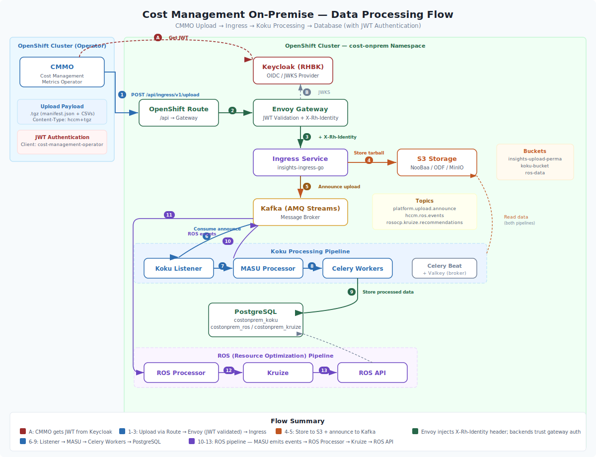

# Cost Management Data Sources and Providers

Guide for configuring and managing data sources (providers) in Cost Management On-Premise.

## Table of Contents

- [Overview](#overview)
- [Provider Types](#provider-types)
- [OpenShift Provider Configuration](#openshift-provider-configuration)
- [Cost Management Metrics Operator Setup](#cost-management-metrics-operator-setup)
- [Data Upload Process](#data-upload-process)
- [Verification and Troubleshooting](#verification-and-troubleshooting)

---

## Overview

Cost Management On-Premise collects cost and usage data from **providers**. A provider represents a source of metrics data - typically an OpenShift cluster with the Cost Management Metrics Operator installed.

### Key Concepts

| Concept | Description |
|---------|-------------|
| **Provider** | An OpenShift cluster configured to send usage metrics |
| **Source** | Configuration entry in Sources API that defines the provider |
| **Cost Management Metrics Operator** | Kubernetes operator that collects metrics and uploads to Cost Management |
| **Cluster ID** | Unique identifier for the OpenShift cluster |
| **Authentication** | JWT token-based authentication for secure uploads |

---

## Provider Types

### OpenShift Container Platform (OCP)

Cost Management On-Premise supports OpenShift Container Platform as the primary provider type.

**Supported Versions:**
- OpenShift 4.18+ (tested with 4.18.24)
- Single Node OpenShift 4.18+

**Required Components:**
- Cost Management Metrics Operator
- Prometheus (OpenShift monitoring)
- User Workload Monitoring enabled

**Collected Metrics:**
- Pod CPU requests, usage, and limits
- Pod memory requests, usage, and limits
- Persistent volume claims
- Node information
- Namespace and pod labels

---

## OpenShift Provider Configuration

### Prerequisites

Before configuring a provider, ensure:

1. **Cluster Access**
   ```bash
   oc whoami
   # Should return authenticated user
   ```

2. **User Workload Monitoring Enabled**
   ```bash
   oc get configmap cluster-monitoring-config -n openshift-monitoring -o yaml | grep enableUserWorkload
   # Should show: enableUserWorkload: true
   ```

3. **Cost Management On-Premise Deployed**
   ```bash
   oc get pods -n cost-onprem
   # Should show all pods running
   ```

### Get Cluster Information

```bash
# Get cluster ID
CLUSTER_ID=$(oc get clusterversion -o jsonpath='{.items[].spec.clusterID}')
echo "Cluster ID: $CLUSTER_ID"

# Get cluster name
CLUSTER_NAME=$(oc get infrastructure cluster -o jsonpath='{.status.infrastructureName}')
echo "Cluster Name: $CLUSTER_NAME"

# Get cluster version
CLUSTER_VERSION=$(oc get clusterversion -o jsonpath='{.items[].status.desired.version}')
echo "Cluster Version: $CLUSTER_VERSION"
```

### Create Provider via Sources API

**Production Method (Recommended):**

Use the Sources API to create providers. This is the production-like flow that triggers Kafka events and proper provider initialization.

See [Sources API Production Flow](../architecture/sources-api-production-flow.md) for complete details.

**Quick Example:**

```bash
# Get API gateway endpoint
API_ROUTE=$(oc get route cost-onprem-api -n cost-onprem -o jsonpath='{.spec.host}')

# Get JWT token (if JWT auth enabled)
JWT_TOKEN=$(./scripts/get-jwt-token.sh)

# Create source (Sources API is now integrated in Koku at /api/cost-management/v1/sources/)
curl -X POST "https://${API_ROUTE}/api/cost-management/v1/sources" \
  -H "Content-Type: application/json" \
  -H "x-rh-identity: ${JWT_TOKEN}" \
  -d '{
    "name": "my-openshift-cluster",
    "source_type_id": 1,
    "uid": "'${CLUSTER_ID}'"
  }'

# Create authentication
# (Follow Sources API Production Flow guide for complete steps)
```

---

## Cost Management Metrics Operator Setup

The Cost Management Metrics Operator collects metrics from Prometheus and uploads them to the Cost Management ingress endpoint.

### Install Operator

The operator is typically installed via OperatorHub in OpenShift.

**Via CLI:**

```bash
# Create namespace
oc create namespace costmanagement-metrics-operator

# Create operator subscription
cat <<EOF | oc apply -f -
apiVersion: operators.coreos.com/v1alpha1
kind: Subscription
metadata:
  name: costmanagement-metrics-operator
  namespace: costmanagement-metrics-operator
spec:
  channel: stable
  name: costmanagement-metrics-operator
  source: redhat-operators
  sourceNamespace: openshift-marketplace
EOF
```

### Configure Operator

**Create CostManagementMetricsConfig Custom Resource:**

```yaml
apiVersion: costmanagement-metrics-cfg.openshift.io/v1beta1
kind: CostManagementMetricsConfig
metadata:
  name: costmanagementmetricscfg
  namespace: costmanagement-metrics-operator
spec:
  # Upload settings
  upload:
    upload_cycle: 360  # Upload every 6 hours (in minutes)
    
  # Authentication (JWT)
  authentication:
    type: token
    secret_name: cost-mgmt-operator-token
    
  # Target endpoint
  api_url: https://cost-onprem-ingress-cost-onprem.apps.example.com
  
  # Validate TLS certificates
  validate_cert: true
  
  # Prometheus configuration
  prometheus_config:
    service_address: https://thanos-querier.openshift-monitoring.svc:9091
    skip_tls_verification: false
```

**Key Configuration Options:**

| Field | Description | Default |
|-------|-------------|---------|
| `upload_cycle` | Minutes between uploads | 360 (6 hours) |
| `api_url` | Cost Management ingress URL | Required |
| `validate_cert` | Verify TLS certificates | true |
| `authentication.type` | Auth type (token, basic, or None) | token |
| `authentication.secret_name` | Secret containing JWT token | Required if type=token |

### Configure JWT Authentication

**Create JWT Token Secret:**

```bash
# Get JWT token for operator
JWT_TOKEN=$(./scripts/get-jwt-token.sh)

# Create secret
oc create secret generic cost-mgmt-operator-token \
  -n costmanagement-metrics-operator \
  --from-literal=token="${JWT_TOKEN}"
```

**See:** [Cost Management Metrics Operator TLS Config Setup](../operations/cost-management-operator-tls-config-setup.md) for complete TLS/JWT configuration.

### Label Namespace for Monitoring

The operator only collects metrics from namespaces labeled with `cost_management_optimizations=true`.

```bash
# Label namespace
oc label namespace my-app-namespace cost_management_optimizations=true

# Verify label
oc get namespace my-app-namespace --show-labels | grep cost_management_optimizations
```

**Note:** The installation script automatically labels the cost-onprem namespace.

---

## Data Upload Process



### Upload Workflow

```
1. Operator queries Prometheus every 15 minutes
2. Collects pod CPU, memory, and label data
3. Packages data into CSV + manifest.json
4. Uploads to S3 via ingress endpoint (JWT authenticated)
5. Ingress writes to S3 and publishes Kafka message
6. MASU processor downloads from S3 and processes
7. Data inserted into PostgreSQL
8. ROS processor forwards to Kruize for recommendations
```

### Upload Schedule

| Interval | Purpose |
|----------|---------|
| **Every 15 minutes** | Operator collects current metrics from Prometheus |
| **Every 6 hours** | Operator packages and uploads data (configurable) |
| **On-demand** | Force upload using `./scripts/force-operator-package-upload.sh` |

### Upload Data Format

**Manifest (manifest.json):**
```json
{
  "uuid": "unique-upload-id",
  "cluster_id": "OpenShift-cluster-UUID",
  "version": "1.0",
  "files": [
    {
      "name": "pod_usage.csv",
      "datetime": "2026-01-29T10:00:00Z"
    }
  ]
}
```

**CSV Data (pod_usage.csv):**
```csv
interval_start,interval_end,namespace,pod,node,resource_id,cpu_request,cpu_limit,cpu_usage,memory_request,memory_limit,memory_usage,pod_labels,node_labels
2026-01-29 10:00:00,2026-01-29 10:15:00,frontend-prod,web-1,node-1,uid-123,500m,1000m,350m,1Gi,2Gi,800Mi,"app=web,env=prod","zone=us-east-1a"
```

---

## Verification and Troubleshooting

### Verify Operator is Running

```bash
# Check operator pod
oc get pods -n costmanagement-metrics-operator

# Check operator logs
oc logs -n costmanagement-metrics-operator deployment/costmanagement-metrics-operator --tail=50
```

**Expected Output:**
```
INFO: Prometheus query successful
INFO: Collected 42 pods across 5 namespaces
INFO: Packaging upload
INFO: Upload successful (202 Accepted)
```

### Verify Data Upload

**Check ingress logs:**
```bash
oc logs -n cost-onprem deployment/cost-onprem-ingress --tail=100 | grep upload
```

**Check S3 bucket:**
```bash
# Get S3 credentials
S3_ENDPOINT=$(oc get route s3 -n openshift-storage -o jsonpath='{.spec.host}')
ACCESS_KEY=$(oc get secret noobaa-admin -n openshift-storage -o jsonpath='{.data.AWS_ACCESS_KEY_ID}' | base64 -d)
SECRET_KEY=$(oc get secret noobaa-admin -n openshift-storage -o jsonpath='{.data.AWS_SECRET_ACCESS_KEY}' | base64 -d)

# List uploads
aws s3 ls s3://cost-bucket/ --endpoint-url https://${S3_ENDPOINT} \
  --aws-access-key-id ${ACCESS_KEY} \
  --aws-secret-access-key ${SECRET_KEY}
```

**Check Kafka topic:**
```bash
oc exec -n kafka cost-onprem-kafka-0 -- bin/kafka-console-consumer.sh \
  --bootstrap-server localhost:9092 \
  --topic platform.upload.announce \
  --from-beginning \
  --max-messages 10
```

### Verify Data Processing

**Check MASU processor logs:**
```bash
oc logs -n cost-onprem deployment/cost-onprem-koku-masu --tail=100 | grep "Processing report"
```

**Query database:**
```bash
# Port-forward to database
oc port-forward -n cost-onprem service/cost-onprem-database 5432:5432 &

# Query latest data
psql -h localhost -U postgres -d costonprem_koku -c "
  SELECT usage_date, namespace, SUM(cpu_request_hours) as total_cpu
  FROM reporting_ocpusagelineitem_daily_summary
  WHERE usage_date >= CURRENT_DATE - 7
  GROUP BY usage_date, namespace
  ORDER BY usage_date DESC, total_cpu DESC
  LIMIT 10;
"
```

### Common Issues

#### 1. No Data in Database

**Symptoms:**
- Operator uploads successfully (202 response)
- No data appears in PostgreSQL

**Resolution:**
```bash
# Check MASU processor is running
oc get pods -n cost-onprem | grep masu

# Check Kafka messages are being consumed
oc logs -n cost-onprem deployment/cost-onprem-koku-listener --tail=50

# Check for processing errors
oc logs -n cost-onprem deployment/cost-onprem-koku-masu --tail=100 | grep ERROR
```

#### 2. Upload Authentication Failures

**Symptoms:**
- 401 Unauthorized responses
- "Invalid JWT token" in logs

**Resolution:**
See [Cost Management Metrics Operator TLS Config Setup](../operations/cost-management-operator-tls-config-setup.md)

#### 3. Missing Namespace Data

**Symptoms:**
- Some namespaces don't appear in cost reports
- Incomplete data

**Cause:** Namespace not labeled for monitoring

**Resolution:**
```bash
# Label the namespace
oc label namespace <namespace-name> cost_management_optimizations=true

# Wait 15 minutes for next operator collection cycle
```

### Force Upload for Testing

To immediately trigger an upload for testing:

```bash
# Use the force upload script
./scripts/force-operator-package-upload.sh

# Or manually trigger
oc exec -n costmanagement-metrics-operator \
  deployment/costmanagement-metrics-operator -- \
  /usr/bin/cost-mgmt-operator package-upload
```

See [Force Operator Upload](../operations/force-operator-upload.md) for complete details.

### Verification Checklist

Use the comprehensive verification checklist:

[Upload Verification Checklist](../operations/cost-management-operator-upload-verification-checklist.md)

---

## Best Practices

### Provider Management

1. **Naming Convention**
   - Use descriptive names: `prod-us-east-1`, `dev-cluster`
   - Include environment and location
   - Keep names consistent across tools

2. **Authentication**
   - Rotate JWT tokens quarterly
   - Use separate tokens per cluster
   - Store tokens in secrets, never in code

3. **Monitoring**
   - Set up alerts for upload failures
   - Monitor upload success rate
   - Track data freshness (time since last upload)

### Data Collection

1. **Namespace Labels**
   - Label all production namespaces
   - Review labeled namespaces quarterly
   - Remove labels from decommissioned namespaces

2. **Upload Frequency**
   - Default 6 hours is suitable for most use cases
   - Increase frequency (2-4 hours) for high-change environments
   - Decrease frequency (12 hours) to reduce load

3. **Data Retention**
   - Keep raw data for 90 days minimum
   - Archive summaries for compliance (1-3 years)
   - Implement automated cleanup policies

---

## Related Documentation

- [Sources API Production Flow](../architecture/sources-api-production-flow.md) - Provider creation workflow
- [Cost Management Metrics Operator TLS Config](../operations/cost-management-operator-tls-config-setup.md) - Authentication setup
- [Force Operator Upload](../operations/force-operator-upload.md) - Manual upload triggering
- [Upload Verification Checklist](../operations/cost-management-operator-upload-verification-checklist.md) - Verify uploads
- [Cost Management Concepts](../operations/cost-management-concepts.md) - Cost calculation and models
- [Troubleshooting Guide](../operations/troubleshooting.md) - Common issues

---

**Last Updated:** 2026-01-29
**Applies to:** Cost Management On-Premise 0.1.5+
